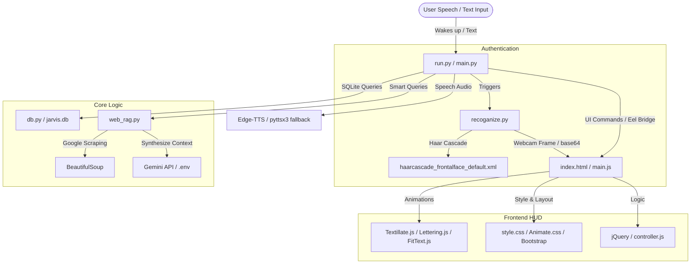

# 🛠️ Jarvis-2025 Tech Stack & Integration Status

This document provides a detailed breakdown of the technologies, libraries, and integration states for the Jarvis-2025 AI Desktop Assistant project. All components requested are **already fully integrated and operational** in the codebase.

---

## 📋 Technology Integration Status

| Technology / Component | File / Location Reference | Status | Role & Integration Details |
| :--- | :--- | :--- | :--- |
| **Python 3.x** | [run.py](file:///f:/Jarvis-2025/run.py), [main.py](file:///f:/Jarvis-2025/main.py) | **Active** | Core programming language powering the backend engine, speech recognition, and multi-process control. |
| **OpenCV** | [recoganize.py](file:///f:/Jarvis-2025/backend/auth/recoganize.py), [haarcascade_frontalface_default.xml](file:///f:/Jarvis-2025/backend/auth/haarcascade_frontalface_default.xml) | **Active** | Used for biometric face authentication (LBPH Face Recognizer) and real-time facial area detection. |
| **Environment Config Manager** | [.env](file:///f:/Jarvis-2025/.env), [.env.example](file:///f:/Jarvis-2025/.env.example), [config.py](file:///f:/Jarvis-2025/backend/config.py) | **Active** | Powered by `python-dotenv` to safely load API keys (e.g., `GEMINI_API_KEY`) from the `.env` file at runtime. |
| **Python Dependency Manager** | [requirements.txt](file:///f:/Jarvis-2025/requirements.txt) | **Active** | PIP package management containing all required libraries (e.g., `opencv-contrib-python`, `python-dotenv`, `google-genai`). |
| **Application Packager** | [desktop.spec](file:///f:/Jarvis-2025/desktop.spec) | **Active** | PyInstaller spec file for compiling the application into a standalone Windows executable (`dist/desktop.exe`). |
| **Database System** | [db.py](file:///f:/Jarvis-2025/backend/db.py) | **Active** | SQLite database module initializing the schema (`sys_command`, `web_command`, and `contacts` tables). |
| **RAG & Web Scraping** | [web_rag.py](file:///f:/Jarvis-2025/backend/web_rag.py), [feature.py](file:///f:/Jarvis-2025/backend/feature.py#L696) | **Active** | Real-time Web Retrieval-Augmented Generation pipeline using `requests` + `BeautifulSoup` for live scraping and Gemini for context synthesis. |
| **Frontend Web Stack** | [index.html](file:///f:/Jarvis-2025/frontend/index.html), [style.css](file:///f:/Jarvis-2025/frontend/style.css), [main.js](file:///f:/Jarvis-2025/frontend/main.js) | **Active** | Sleek HUD-style dashboard rendering custom UI, live stats, Siri-like wave visualizer, and chat logs. |
| **Frontend: jQuery** | [index.html](file:///f:/Jarvis-2025/frontend/index.html#L402) | **Active** | Included via Google CDN to simplify DOM manipulation, event handling, and UI transition triggers. |
| **Frontend: Textillate** | [index.html](file:///f:/Jarvis-2025/frontend/index.html#L414), [main.js](file:///f:/Jarvis-2025/frontend/main.js#L21) | **Active** | JS library used to apply premium CSS3 text animations to assistant messages and greeting text. |
| **Frontend: Animate.css** | [index.html](file:///f:/Jarvis-2025/frontend/index.html#L23) | **Active** | Local stylesheet providing custom micro-animations (e.g. bounce, fade) for Textillate. |
| **Frontend: FitText.js** | [index.html](file:///f:/Jarvis-2025/frontend/index.html#L412) | **Active** | Local script ensuring that text size scales dynamically based on the width of the containing elements. |
| **Frontend: Lettering.js** | [index.html](file:///f:/Jarvis-2025/frontend/index.html#L413) | **Active** | Local script that gives Textillate granular, letter-by-letter CSS animation control. |

---

## 🚀 How These Components Work Together



---

## 🛠️ Verification & Execution Commands

### 1. Database Initialization
To create/verify SQLite database schemas:
```bash
python -m backend.db
```

### 2. Capture & Train Face Samples
Before starting face recognition, capture face samples (creates `backend/auth/samples/` directory) and train the LBPH model:
```bash
# Capture 200 face images
python -m backend.auth.sample

# Train the LBPH classifier model (generates trainer.yml)
python -m backend.auth.trainer
```

### 3. Run the Assistant
To run the full multi-process assistant (Eel server dashboard + background hotword listener):
```bash
python run.py
```
*Alternatively, double-click the [start.bat](file:///f:/Jarvis-2025/start.bat) file.*

### 4. Build Standalone Package
To compile all modules (Python + HTML + CSS + JS) into a standalone `.exe`:
```bash
pyinstaller desktop.spec
```
